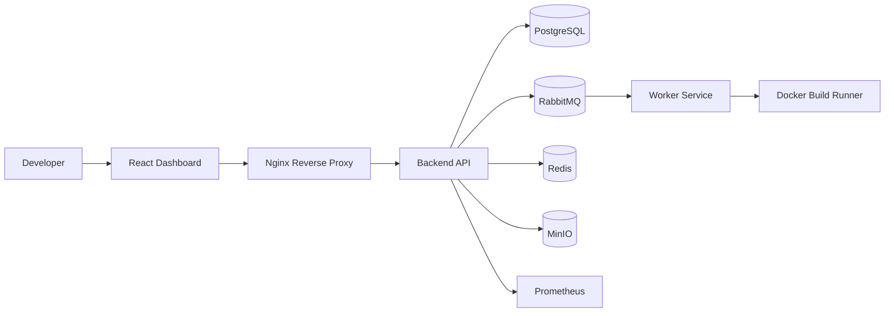

# Enterprise CI/CD Platform

A production-oriented monorepo for an enterprise CI/CD platform with a backend API, worker service, React dashboard, Docker deployment, and observability hooks.

## Highlights

- Authentication, repository, and webhook handling in the backend
- RabbitMQ-backed build queue and worker execution
- Real-time dashboard and analytics experience
- Docker Compose deployment with Nginx, health checks, and Prometheus
- Swagger documentation and test coverage for core features

## Architecture

The platform is organized as a modular monorepo where each service has a focused responsibility:

- Backend API handles authentication, repositories, webhook processing, and build orchestration.
- Worker service consumes queued build jobs and executes them in isolated Docker containers.
- Frontend dashboard provides a modern interface for monitoring builds, workers, and analytics.
- Shared package centralizes environment helpers and Prisma access.

### Architecture Diagram



## Folder Structure

```text
apps/
  backend/
    src/
      application/
      domain/
      interfaces/
      lib/
  worker/
    src/
  frontend/
    src/
packages/
  shared/
    prisma/
    src/
nginx/
  default.conf
  certs/
monitoring/
  prometheus.yml
```

## Installation Guide

### Prerequisites

- Node.js 20+
- Docker and Docker Compose
- Git

### Setup

```bash
npm install
cp .env.example .env
npm run prisma:generate
docker compose up --build
```

### Development Commands

```bash
npm run build
npm --workspace apps/backend run test
npm --workspace apps/worker run test
npm --workspace apps/frontend run build
```

## Deployment Guide

### Local Deployment

```bash
docker compose up --build -d
```

### Access Points

- Frontend: http://localhost/
- Backend health: http://localhost/api/health
- Swagger: http://localhost/api/docs
- RabbitMQ UI: http://localhost:15672
- Prometheus: http://localhost:9090

### Production Notes

- Place TLS certificates in nginx/certs/server.crt and nginx/certs/server.key for HTTPS termination.
- Store secrets in a secure secret manager instead of plain environment files.
- Add a load balancer or ingress controller if you expose the stack publicly.

## Testing

```bash
npm --workspace apps/backend run test
npm --workspace apps/worker run test
npm --workspace apps/frontend run build
```

## Swagger

After the backend is running, open http://localhost/api/docs to view the API documentation.

## Possible Improvements

- Connect the frontend analytics cards to live backend metrics.
- Add artifact download and build log retention.
- Introduce Kubernetes-based autoscaling and deployment pipelines.
- Expand test coverage with end-to-end scenarios.
- Add role-based access control and stronger security policies.

